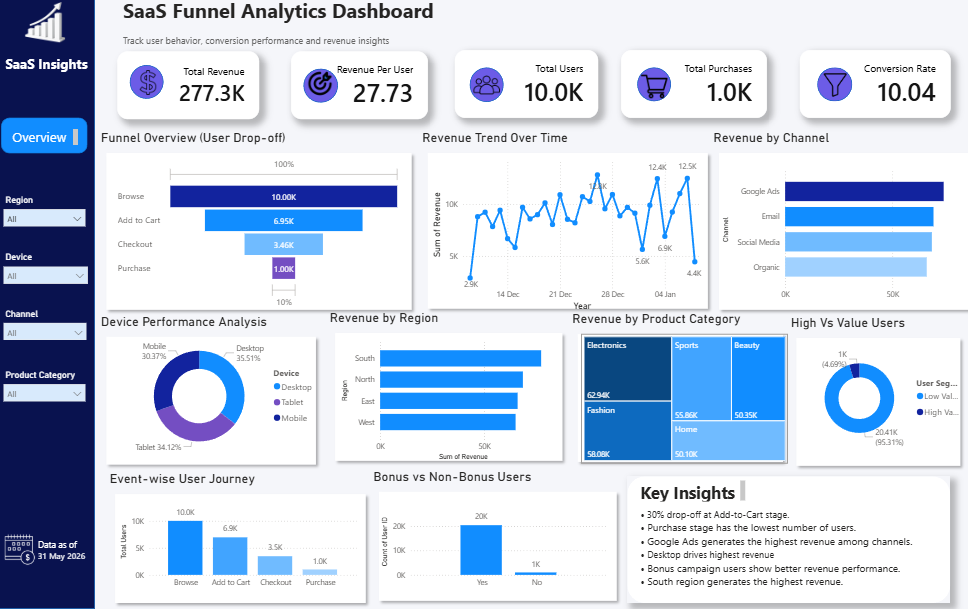

# SaaS Funnel Analytics Dashboard

## Project Overview

This project analyzes user behavior across a SaaS conversion funnel using Python, SQL, and Power BI. The objective is to identify funnel drop-offs, high-performing marketing channels, user segmentation patterns, regional performance, and campaign effectiveness.

The project combines exploratory data analysis, SQL-based business analysis, DAX measures, and an interactive Power BI dashboard to generate actionable business insights and support data-driven decision-making.

---

## Business Problem

The analysis focuses on solving the following business problems:

* Where users drop off in the conversion funnel
* Which marketing channels generate the highest revenue
* Which device types contribute most to purchases
* Which regions perform best
* Whether bonus campaigns improve revenue
* Which user segments are most valuable

---

## Tools & Technologies

* Python
* Pandas
* SQL
* Power BI
* DAX
* GitHub

---

## Skills Demonstrated

* Exploratory Data Analysis (EDA)
* Funnel Analysis
* SQL Querying
* KPI Development
* DAX Calculations
* Business Intelligence Reporting
* Dashboard Design
* Business Insight Generation

---

## Key Business Questions

### Funnel Analysis

* At which stage do most users drop off?
* What is the overall conversion behavior across stages?

### Revenue Analysis

* Which channels generate the highest revenue?
* Which product categories perform best?

### User Analysis

* Which device type contributes the highest revenue?
* How are users distributed across high-value and low-value segments?

### Campaign Analysis

* Do bonus campaigns improve revenue performance?

---

## Dashboard Features

* Executive KPI Cards
* Funnel Conversion Analysis
* Revenue Trend Analysis
* Marketing Channel Performance
* Device & Regional Analysis
* User Segmentation
* Campaign Impact Analysis
* Event-wise User Journey

---

## Key Insights

* Significant user drop-off occurs between Browse and Add-to-Cart stages.
* Desktop users contribute the highest revenue share.
* High-performing acquisition channels generate stronger monetization.
* Bonus campaign users demonstrate improved revenue contribution.
* Revenue is concentrated among a smaller segment of high-value users.
* Regional performance differences highlight revenue concentration opportunities.

---

## Business Recommendations

* Optimize the Add-to-Cart experience to reduce funnel drop-offs.
* Improve mobile checkout experience to increase mobile conversions.
* Increase investment in high-performing marketing channels.
* Continue targeted campaigns for high-value users.
* Improve retention strategies for premium customer segments.

---

## Project Workflow

1. Data Cleaning using Python & Pandas
2. Exploratory Data Analysis (EDA)
3. SQL-based Business Query Analysis
4. Data Modeling in Power BI
5. KPI & Funnel Dashboard Creation
6. Business Insights Extraction

---

## Project Structure

```bash
SaaS-Funnel-Analytics/
│
├── data/
├── notebook/
├── dashboard/
├── screenshots/
├── README.md
└── requirements.txt
```

---

## Dashboard Preview



---

## Final Outcome

This project demonstrates how data analytics can be used to analyze SaaS product performance, optimize conversion funnels, and support business decision-making using interactive dashboards and data-driven insights.
